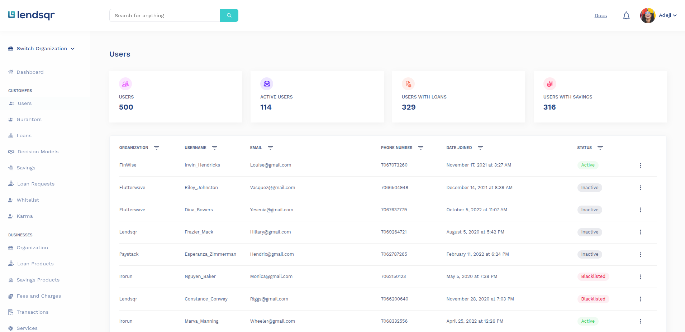

# Lendsqr FE – User Management Dashboard

A modern, responsive user management dashboard built with React, TypeScript, and Vite. This project simulates a real-world admin interface for managing users, including features like filtering, pagination, user status management (activate, blacklist, deactivate), and more.

---

## Table of Contents
- [Lendsqr FE – User Management Dashboard](#lendsqr-fe--user-management-dashboard)
  - [Table of Contents](#table-of-contents)
  - [Demo](#demo)
  - [Features](#features)
  - [Tech Stack](#tech-stack)
  - [Getting Started](#getting-started)
    - [Prerequisites](#prerequisites)
    - [Installation](#installation)
    - [Running Locally](#running-locally)
    - [Building for Production](#building-for-production)
    - [Running Tests](#running-tests)
  - [Project Structure](#project-structure)
  - [Key Concepts](#key-concepts)
    - [Routing](#routing)
    - [State Management](#state-management)
    - [API Integration](#api-integration)
    - [User Actions](#user-actions)
    - [Filtering \& Pagination](#filtering--pagination)
  - [Environment Variables](#environment-variables)
  - [License](#license)

---

## Demo

[Link to Live Demo](https://peace-oghenevwefe-lendsqr-fe-test.vercel.app/)



---

## Features
- **User List & Details:** View, filter, and paginate through a list of users. Click to see detailed user info.
- **User Status Management:** Activate, deactivate, or blacklist users directly from the dashboard.
- **Filtering:** Filter users by organization, username, email, phone, date joined, and status.
- **Pagination:** Efficiently navigate large user datasets.
- **Responsive UI:** Works seamlessly on desktop and mobile.
- **State Management:** Uses Zustand for global state.
- **API Integration:** Fetches user data from a mock API.
- **Testing:** Includes unit tests for core UI components.

---

## Tech Stack
- **Frontend:** [React](https://react.dev/) + [TypeScript](https://www.typescriptlang.org/)
- **Build Tool:** [Vite](https://vitejs.dev/)
- **State Management:** [Zustand](https://zustand-demo.pmnd.rs/)
- **API Client:** [Axios](https://axios-http.com/)
- **Routing:** [React Router](https://reactrouter.com/)
- **Forms & Validation:** [Formik](https://formik.org/), [Yup](https://github.com/jquense/yup)
- **Styling:** [Sass/SCSS](https://sass-lang.com/)
- **Testing:** [Jest](https://jestjs.io/), [React Testing Library](https://testing-library.com/)
- **UI/UX:** Custom components, Lottie animations

---

## Getting Started

### Prerequisites
- [Node.js](https://nodejs.org/) (v18+ recommended)
- [Yarn](https://yarnpkg.com/) or [npm](https://www.npmjs.com/)

### Installation
```bash
git clone https://github.com/Peazzycole/lendsqr-fe-test.git
cd lendsqr-fe-test
yarn install # or npm install
```

### Running Locally
```bash
yarn dev # or npm run dev
```
Visit [http://localhost:5173](http://localhost:5173) in your browser.

### Building for Production
```bash
yarn build # or npm run build
```

### Running Tests
```bash
yarn test # or npm run test
```

---

## Project Structure
```
├── src/
│   ├── assets/           # Images, icons, animations
│   ├── components/       # Reusable UI and feature components
│   ├── hooks/            # Custom React hooks
│   ├── pages/            # Route-level pages (Login, Dashboard, Users, User Details)
│   ├── routes/           # App routing configuration
│   ├── services/         # API and storage services
│   ├── store/            # Zustand state stores
│   ├── styles/           # Global and modular SCSS
│   ├── types/            # TypeScript type definitions
│   ├── utils/            # Helpers, constants
│   └── tests/            # Test utilities and mocks
```

---

## Key Concepts

### Routing
- Uses React Router v7 for client-side navigation.
- Public and protected routes are separated for authentication flow.

### State Management
- Zustand is used for global state (users, stats, etc.).
- React Query handles server state and caching for API calls.

### API Integration
- All user data is fetched from a mock API (`https://vo49r.wiremockapi.cloud`).
- API logic is abstracted in `src/services/api/users.api.ts`.

### User Actions
- Users can be activated, deactivated, or blacklisted from the UI.
- Actions update both the UI state and local storage for persistence.

### Filtering & Pagination
- Users can be filtered by multiple fields.
- Pagination is handled client-side for performance.

---

## Environment Variables

The API base URL is set in `src/utils/constants.ts` as `BASE_URL`. To use a different API, update this value.

---

## License

This project is licensed under the MIT License.
